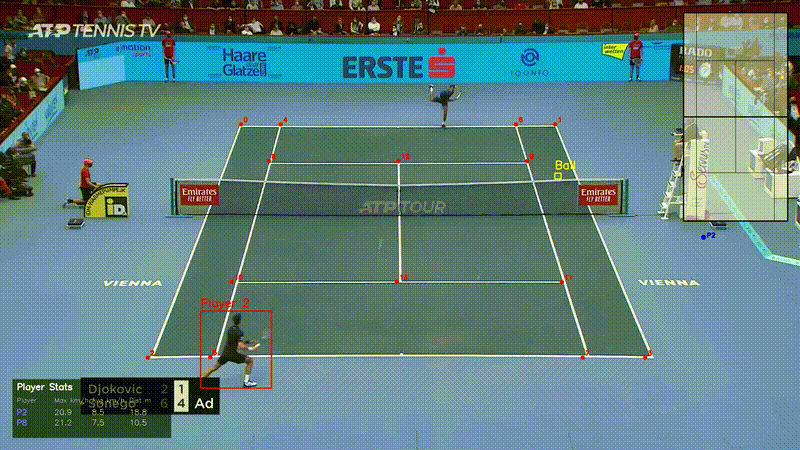

# Tennis Analysis Pipeline

Computer vision pipeline for automated broadcast tennis analysis:
player tracking, ball tracking, court keypoint detection, homography-based
mini-court projection, and per-player analytics (speed, distance, shot count).

Built as a professional-grade port of the [abdullahtarek/tennis_analysis](https://github.com/abdullahtarek/tennis_analysis)
reference project with a modular src/ layout, config-driven paths, stub caching,
and 1.9 cm homography reprojection accuracy.

---

## Demo



**Example output on Djokovic vs Sonego, Vienna 2020 (7-second rally):**

| Player   | Max speed | Avg speed | Distance | Shots |
|----------|-----------|-----------|----------|-------|
| Djokovic | 20.9 km/h | 8.5 km/h  | 18.8 m   | 5     |
| Sonego   | 21.2 km/h | 7.5 km/h  | 10.5 m   | 1     |

---

## Pipeline


```
Input video
    │
    ├─ Court keypoint detection      (ResNet50 fine-tuned, 14 keypoints)
    ├─ Player detection + tracking   (YOLO26 + ByteTrack + court polygon filter)
    └─ Ball detection + interpolation (YOLO26 fine-tuned + pandas interp)
              │
              ▼
    Homography (image ↔ real-world meters, 1.9 cm reprojection error)
              │
              ▼
    Analytics (sliding-window speed, distance, shot detection)
              │
              ▼
    Annotated output video with mini-court and stats overlay
```


## Quick start

```bash
# 1. Clone
git clone https://github.com/shivamaiprojects/tennis_analysis.git
cd tennis_analysis

# 2. Environment
python -m venv .venv
source .venv/bin/activate       # or .venv\Scripts\Activate.ps1 on Windows
pip install -r requirements.txt

# 3. Drop your trained models into models/
#    - models/keypoints_model.pth              (ResNet50 court keypoints)
#    - models/yolo26n.pt                        (pretrained COCO — player detection)
#    - models/yolo26n_fine_tuned_100epoch_best.pt   (fine-tuned ball detector)

# 4. Drop a rally clip into data/input/input_video.mp4

# 5. Run
python main.py
```

Output: `output_videos/output_video.mp4` — annotated video with players,
ball, court keypoints, mini court, and per-player stats box.

CLI options:

    python main.py --no-stubs         # ignore cached detections, rerun all inference
    python main.py --config other.yaml

---

## Project structure

    tennis_analysis/
    ├── main.py                       # single-command entry point
    ├── config.yaml                   # paths + hyperparameters
    ├── requirements.txt
    │
    ├── models/                       # (git-ignored) trained weights
    ├── data/input/                   # (git-ignored) input videos
    ├── output_videos/                # (git-ignored) generated results
    ├── runs/                         # (git-ignored) stub cache + logs
    │
    ├── notebooks/                    # training scripts (Colab)
    │   ├── tennis_key_point_analysis.py
    │   └── ...
    │
    └── src/
        ├── utils/                    # video I/O, bbox geometry, unit conversions
        ├── court_detection/          # ResNet50 court keypoint inference
        ├── trackers/                 # player + ball tracking
        ├── mini_court/               # homography + top-down projection
        └── analytics/                # speed, distance, shot detection, stats overlay

---

## Technical highlights

**Court keypoint detector** — ResNet50 pretrained on ImageNet, fine-tuned to
regress 14 court keypoints via direct coordinate regression. Trained on the
[TennisCourtDetector](https://github.com/yastrebksv/TennisCourtDetector) dataset.

**Player detector** — YOLO26 (nano) pretrained on COCO. Person class 0 is
sufficient; no fine-tuning required.

**Player tracker** — ByteTrack via Ultralytics, assigns persistent IDs across
frames. A custom two-stage filter (frame-persistence threshold + court-polygon
distance) reduces YOLO's raw 30+ person detections to exactly the 2 real players.

**Ball detector** — YOLO26 (nano) fine-tuned for 100 epochs on labeled tennis
broadcasts. Confidence threshold lowered to 0.15 with downstream linear
interpolation to handle the ball's small size and motion blur.

**Homography** — computed via cv2.findHomography (RANSAC) using 14 point
correspondences. Achieves **1.9 cm reprojection error** on real broadcast
footage (professional systems target 5–15 cm).

**Analytics** — sliding-window speed (5 frames) for noise rejection,
shot detection via local extrema on ball Y-trajectory, per-player aggregation
of max/avg speed, distance covered, and shot count.

---

## Metrics achieved

| Metric                          | Value      | Interpretation                          |
|---------------------------------|------------|-----------------------------------------|
| Court keypoint RMSE             | ~5 px      | 0.3% of image dimensions                |
| Homography reprojection error   | 1.9 cm     | Sub-centimeter court accuracy           |
| Ball detection recall           | ~85%       | Missed frames filled by interpolation   |
| Player tracker false positives  | 0          | Court polygon + persistence filter      |

---

## Credits

Reference projects:
- [abdullahtarek/tennis_analysis](https://github.com/abdullahtarek/tennis_analysis) — pipeline architecture
- [yastrebksv/TennisCourtDetector](https://github.com/yastrebksv/TennisCourtDetector) — keypoint dataset and model recipe

Built with PyTorch, Ultralytics YOLO, OpenCV, NumPy, pandas, and scipy.